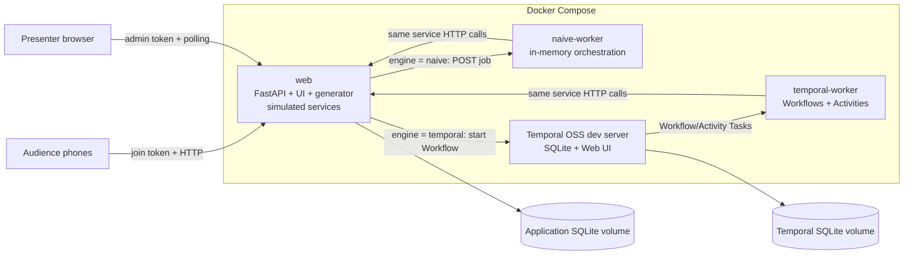

# Cup Night Ticket Rush — Temporal Demo Implementation Plan

**Status:** Approved v1.0 — ready for one-shot implementation

**Last updated:** 25 August 2026

## 1. Executive summary

Build a deliberately simplified, CPFC-branded match-ticket checkout demonstration with two interchangeable orchestration engines:

1. an ordinary in-process Python implementation whose work is lost when its process dies; and
2. a Temporal Workflow implementation that resumes after the same process death.

Both implementations must execute the same business steps, call the same simulated downstream services, use the same injected failures, and render into the same dashboard. The orchestration mechanism is the only material variable.

The headline failure happens after a simulated payment has been committed but before the caller records completion:

```text
Reserve ticket → Charge payment → Issue ticket → Award points → Confirm
                         ↑
                  worker dies here
```

In the naïve run, the supporter remains charged without a ticket. In the Temporal run, the Activity is retried after the Worker restarts, the idempotency key prevents a second charge, and the order finishes.

The implementation will be local-development software, started with Docker Compose. Temporal will be the open-source CLI development server with persistence and the included Web UI. Python dependencies will be managed exclusively with `uv`.

### Recommended implementation at a glance

| Area | Decision |
| --- | --- |
| Backend | Python 3.12, FastAPI, `uv` |
| Frontend | Server-served HTML, CSS, and small vanilla JavaScript modules |
| Live updates | Revision-aware HTTP polling every 500 ms; no WebSocket dependency |
| App state | SQLite owned exclusively by the `web` service |
| Temporal | OSS `temporal server start-dev` in Docker with persisted SQLite and Web UI |
| Process model | `web`, `naive-worker`, `temporal-worker`, and `temporal` Compose services |
| Feature switch | One string literal: `CHECKOUT_ENGINE = "naive"` → `"temporal"` |
| Main fault | Atomically armed, one-shot real process exit after payment commit |
| Synthetic load | Default target: 500 orders at 25 orders/second, benchmark-adjusted |
| Ordinary reset | Start a fresh demo run, terminate open old Workflows, preserve histories |
| Hard reset | Offstage only: `docker compose down -v` |

## 2. Why this story fits the audience

Ticketing and loyalty points are the most persistent subjects in the supplied Fan Advisory Board summary. The recurring need is not simply access to every ticket; it is trust that a consequential process is fair, consistent, and explainable. Digital ticketing, resale and transfer, and accessible ticketing also recur in the source. The demo uses that familiar setting without claiming to reproduce or prescribe Crystal Palace's real system. [CPFC interview summary](https://docs.google.com/document/d/1tDE-GbWe9uroJFLq72LqT3Blq-R82Kg9mk3a8Ex-mGc/edit)

This is an educational reliability demonstration, not a sales proposal or a reconstruction of CPFC ticketing rules.

## 3. Goals and non-goals

### Goals

- Make durable execution understandable to a mixed technical and non-technical room.
- Show a failure with a visible business consequence: payment recorded, ticket absent.
- Demonstrate a real process death, not merely a caught exception or red animation.
- Keep the admin dashboard alive while either processing Worker dies.
- Let approximately 15 audience members submit a fictional order from a phone.
- Add synthetic traffic through the exact same submission route as audience traffic.
- Make low-volume orders legible as cards and high-volume orders legible as tiles.
- Show that Temporal resumes work after Worker restart.
- Teach that Activity retries require idempotent external side effects.
- Keep the implementation deterministic enough to rehearse and repeat.
- Start the complete environment with one Docker Compose command after dependencies and images are cached.
- Make normal reset fast and presenter-safe without erasing Temporal's audit history.

### Non-goals for v1

- Real payments, payment SDKs, card entry, email delivery, or real ticket issuance.
- Modelling CPFC's real allocation, loyalty, resale, concession, or accessibility policies.
- Inventory contention, seat scarcity, overselling, refunds, or Saga compensation.
- Production deployment, production authentication, or a production-grade Temporal cluster.
- Grafana, Prometheus, Elasticsearch, Kafka, Redis, or a separate frontend build toolchain.
- Proving that Temporal is the only possible durable design. A bespoke queue, outbox, retry service, and state machine could also solve this; the point is how much machinery Temporal supplies.
- Deleting Workflow histories from the ordinary Reset button.

## 4. Resolved decisions

All material product decisions are resolved. Ordinary implementation choices within this plan do not require another approval round.

| ID | Approved decision |
| --- | --- |
| Q0 | The presentation is today, 25 August. Use the overnight implementation window and protect time for a complete automated and manual rehearsal before handoff. |
| Q1 | The live demonstration is 10 minutes followed by 5 minutes of Q&A. |
| Q2 | Use ngrok plus a generated QR code as the preferred attendee-phone path. Retain LAN and synthetic/presenter fallbacks. ngrok 3.39.8 is already installed and its local configuration validates successfully. |
| Q3 | Permit optional attendee nicknames on the projected board, with clear room-visibility copy and generated aliases for anyone who leaves the field blank. Collect no other personal data. |
| Q4 | No supplied brand pack is available. Source and bundle the correct current CPFC crest and Temporal marks from first-party sources, document their origins, and use the current sash-inspired identity. |
| Q5 | Use the fictional fixture `Palace v Northbridge United · Cup Night · Selhurst Park`, clearly marked as fictional. |
| Q6 | Include `Award loyalty points` as a visible but secondary fifth Activity. |
| Q7 | Use the live one-line `CHECKOUT_ENGINE = "naive"` → `"temporal"` change and a short web reload. Do not add an admin engine toggle. |
| Q8 | Start fresh run preserves Workflow histories and the previous run's KPI snapshot while terminating only open old Workflows. |
| Q9 | Target 500 synthetic orders at 25 orders/second, tuning only when measured rehearsal performance requires it. |
| Q10 | Optimize and verify the presenter dashboard for Chrome at 1920×1080. Retain a basic 1366×768 safety check where inexpensive. |

## 5. Demonstration contract

These invariants protect the credibility of the comparison:

1. Both engines receive the same immutable `OrderRequest` shape.
2. Both engines execute the same ordered business steps.
3. Both engines call the same HTTP endpoints for every simulated external side effect.
4. Every simulated external side effect is idempotent.
5. Both engines see the same run-scoped fault configuration and deterministic failure decisions.
6. Both engines run in disposable processes with the same Docker restart policy.
7. The app state store and dashboard are outside both killable processes.
8. The injected crash is an actual `os._exit(86)` after payment commit.
9. The Temporal implementation may not read fault settings, call the network, access the database, use system time, or generate ordinary randomness from Workflow code. Those actions belong in Activities.
10. A temporarily retrying Temporal order must not be presented as terminally failed.
11. The UI must clearly label all orders, payments, seats, tickets, and fixtures as synthetic.

## 6. Live story and run-of-show

The primary story must finish inside 10 minutes, leaving 5 minutes for Q&A.

### Ten-minute timing

| Time | Beat |
| --- | --- |
| 0:00–1:15 | Introduce the fictional checkout while the room scans the QR code. |
| 1:15–2:30 | Healthy audience orders move through the naïve board at low volume. |
| 2:30–4:00 | Start Ticket rush, arm the crash, and reveal charged-without-ticket plus lost in-flight work. |
| 4:00–5:00 | Explain that the business process lived only in Worker memory. |
| 5:00–5:45 | Change the one engine string, let `web` reload, and start a fresh Temporal run. |
| 5:45–7:45 | Repeat the same rush and crash; watch the Worker restart and the order recover. |
| 7:45–9:15 | Open the selected Workflow in Temporal Web UI and show the failed attempt, retry, and Event History. |
| 9:15–10:00 | Explain payment idempotency versus durable orchestration and land the closing line. |

The loyalty Activity is visible in the progress tracker and code but should not receive separate narration unless time remains.

### Before the audience arrives

- Run the preflight script and confirm all four services are healthy.
- Confirm the demo can run with Wi-Fi disabled after all dependencies and images are cached.
- Open four prepared windows/tabs:
  - CPFC participant page or its QR code;
  - custom admin dashboard;
  - the single engine-selection line in the editor; and
  - Temporal Web UI at `http://localhost:8233`.
- Run one hidden naïve and one hidden Temporal crash rehearsal.
- Perform an ordinary Reset and leave the active engine as `naive`.

### Act 1 — Establish the ordinary implementation

1. Introduce the fictional Cup Night checkout.
2. Invite attendees to scan the QR code and request one demo ticket.
3. Run at audience pace with healthy services.
4. Show full cards moving through the board and the mobile progress tracker completing.
5. Explain the simple Python sequence without discussing Temporal yet.

Expected result: the system looks entirely adequate at low volume.

### Act 2 — Add matchday pressure and break it

1. Select the `Ticket rush` preset and start synthetic traffic.
2. Optionally select `Ticket API flaky` to demonstrate conventional transient failures.
3. Arm `Crash after next audience payment`.
4. Ask one attendee to submit, or use the presenter test participant.
5. The naïve Worker commits that simulated charge and exits.
6. Its Docker container restarts, but in-memory work and queued jobs have disappeared.
7. The dashboard stays live and shows:
   - Worker offline, then online;
   - the triggering audience order stranded in `Payment charged`;
   - a red `Charged / no ticket` KPI; and
   - other in-flight naïve jobs lost during the process death.

Teaching line:

> The services and database are still here. What disappeared was the knowledge of what the business process had already done and what it still owed the supporter.

### Act 3 — Reveal the orchestration change

1. Stop synthetic traffic.
2. Show the engine-selection line:

   ```python
   CHECKOUT_ENGINE = "naive"  # change to "temporal"
   ```

3. Change the string to `"temporal"` and save.
4. The web service reloads; dashboard polling reconnects automatically.
5. Start a fresh run. Preserve the previous naïve KPI summary in a comparison strip.

The Temporal Worker is already running and idle; the code change only changes where new submissions are sent.

### Act 4 — Repeat the same failure with Temporal

1. Start the same synthetic preset.
2. Arm the same one-shot crash after payment.
3. Submit an audience order.
4. The Temporal Worker commits the charge and exits before acknowledging Activity completion.
5. The order becomes amber: payment exists, ticket does not yet exist, and the Workflow is retrying.
6. Docker restarts the Worker.
7. After the Activity timeout, Temporal retries `charge_payment` using the same idempotency key.
8. The payment simulator returns the original receipt instead of creating a second charge.
9. Ticket issuance, loyalty, and confirmation finish; the red/amber KPI returns to zero.

### Act 5 — Prove it in Temporal

1. Select the recovered audience card.
2. Open its Workflow in Temporal Web UI.
3. Show the Event History around the failed Activity attempt and retry.
4. Point out that payment idempotency and Temporal durability solve different halves of the problem.

Closing line:

> The process did not survive because the Worker stayed alive. It survived because the process no longer lived only inside that Worker.

## 7. System architecture



### Service responsibilities

| Service | Responsibilities | Must survive worker crash? |
| --- | --- | --- |
| `web` | Participant and admin pages, API, order acceptance, engine routing, synthetic generator, dashboard snapshots, reset orchestration, fault configuration, all simulated downstream services, sole app-DB ownership | Yes |
| `naive-worker` | Accept a job over internal HTTP, hold its queue and orchestration state only in memory, execute sequential calls, send heartbeat | No; Docker restarts it |
| `temporal-worker` | Register `TicketOrderWorkflow` and Activities, poll Temporal Task Queue, call the same service endpoints, send heartbeat | No; Docker restarts it |
| `temporal` | OSS development Temporal Service, durable Workflow History, Visibility, default namespace, Web UI | Normally yes; persisted volume also survives Compose restart |

### Why SQLite remains safe here

Only `web` opens the application SQLite file. Workers never mount or write it; they call the owning service over HTTP. This avoids multi-container SQLite locking and makes the simulated downstream services behave like genuinely external systems.

Temporal uses its own unrelated SQLite persistence file through the official CLI development server.

## 8. Order lifecycle

### Immutable request

```text
OrderRequest
├── order_id
├── demo_run_id
├── sequence_number
├── source: audience | synthetic
├── supporter_alias
├── fictional_section
├── fictional_price_pence
└── engine: naive | temporal
```

No email, telephone number, address, real card details, or authentication identity is collected.

### Business steps

| Step | Simulated side effect | Idempotency key | Visible milestone |
| --- | --- | --- | --- |
| Accept order | Create immutable order record | `order:{order_id}` | Requested |
| Reserve ticket | Create fictional seat reservation | `reservation:{order_id}` | Reserved |
| Charge payment | Create fixed-value simulated charge | `charge:{order_id}` | Payment charged |
| Issue ticket | Create watermarked demo ticket | `ticket:{order_id}` | Ticket issued |
| Award loyalty points | Append a fictional ledger entry | `points:{order_id}` | Secondary card detail |
| Send confirmation | Record a simulated notification | `confirmation:{order_id}` | Complete |

All endpoints return the already-created resource on a duplicate idempotency key. Payment idempotency is the code excerpt to feature during the talk, but the other Activities are idempotent as good practice because any Activity may execute more than once.

### Milestone versus health

Board position represents the furthest committed business milestone. Card or tile treatment represents orchestration health.

| Health | Meaning | Rendering |
| --- | --- | --- |
| Processing | Work is actively progressing | Palace blue + circle |
| Retrying | Temporal durably owns the order and an Activity is retrying | Amber + diagonal mark |
| Worker unavailable | Owning worker heartbeat is stale | Amber outline + worker icon |
| Stranded | Naïve work has made no progress beyond the threshold after its process returned | Red + alert mark |
| Terminal failure | Explicit safe business failure, such as a simulated decline before charge | Red + X; Failed column |
| Complete | All required steps finished | Green + check |

A Temporal order may briefly be charged without a ticket while recovering. It must remain amber rather than red while its Workflow is still open and retrying.

## 9. The exact crash mechanism

### One-shot crash token

The presenter action `Arm crash after next audience payment` creates one run-scoped token. Targeting audience traffic prevents a synthetic order from consuming the dramatic moment.

The payment endpoint performs this transaction:

1. Validate that the order belongs to the active run.
2. Insert or retrieve the simulated payment under unique key `charge:{order_id}`.
3. Atomically consume one matching crash token, if present.
4. Append the payment service event.
5. Commit the transaction.
6. Return the receipt with `crash_after_commit=true` when it consumed the token.

The calling Worker then executes:

```python
if response.crash_after_commit:
    os._exit(86)
```

This exits the real Worker process after the side effect is committed and before its orchestration layer acknowledges completion.

### Naïve outcome

- The HTTP job and in-memory queue vanish with the process.
- Docker restarts the container, but no persisted coordinator scans for unfinished jobs.
- The payment row remains because it belongs to the external service simulation.
- No ticket appears.
- The dashboard derives `charged, no ticket` directly from external facts.

### Temporal outcome

- Temporal has not received Activity completion.
- The Activity attempt times out.
- The restarted Worker receives a retry.
- `charge:{order_id}` returns the existing receipt.
- The Workflow advances to ticket issuance and completes.

This deliberately demonstrates the at-least-once Activity model. Temporal does not make a remote card processor exactly-once; a stable business idempotency key makes a repeated Activity safe. [Temporal Activity idempotency guidance](https://docs.temporal.io/develop/python/best-practices/error-handling#make-activities-idempotent)

## 10. Other fault injection

### Presenter presets

- `Healthy`: zero injected errors, modest step latency.
- `Ticket API flaky`: deterministic transient ticket errors.
- `Payment API slow`: increased payment latency without decline.
- `Ticket rush`: 500-order synthetic run at the benchmarked rate.
- `Crash after charge`: arm the one-shot real process exit.

### Advanced controls

- Reservation transient error percentage.
- Payment transient error percentage.
- Ticket-service transient error percentage.
- Added service latency.
- Synthetic orders per second.
- Synthetic target count.
- Target the next audience order or next order for a crash.

Do not include a general “randomly kill processes” slider. The headline crash is atomic and one-shot so it can neither miss nor create an endless crash loop.

### Deterministic transient failures

For each request, calculate a stable value from:

```text
demo seed + order sequence + service step + attempt number
```

Compare that value with the configured percentage. Resetting with the standard seed reproduces the same synthetic pattern.

- The naïve helper makes at most two in-memory attempts for transient errors. This makes the baseline more credible than a zero-retry strawman while remaining vulnerable to process death.
- Temporal uses the SDK Activity attempt number and a retry policy.
- Fault decisions never occur inside Workflow code.

### Temporal retry settings

Initial proposed policy, to tune in rehearsal:

```python
RetryPolicy(
    initial_interval=timedelta(seconds=1),
    backoff_coefficient=2.0,
    maximum_interval=timedelta(seconds=5),
    maximum_attempts=0,
)
```

- Activity `start_to_close_timeout`: 5 seconds.
- Activity `schedule_to_close_timeout`: 90 seconds.
- Workflow execution timeout: 5 minutes.
- Explicit simulated card declines raise a non-retryable Application Error before any charge is committed.

The five-second Activity timeout creates a visible recovery pause without making the room wait. Temporal requires an Activity timeout and recommends custom retry policies for application-specific behavior. [Python Activity timeouts](https://docs.temporal.io/develop/python/activities/timeouts), [retry guidance](https://docs.temporal.io/develop/python/best-practices/error-handling#configure-custom-retry-policies)

## 11. Temporal design

### Workflow

`TicketOrderWorkflow` receives one dataclass input and invokes granular Activities serially:

```text
reserve_ticket
charge_payment
issue_ticket
award_loyalty_points
send_confirmation
```

The Workflow contains only deterministic orchestration. It does not import the HTTP client, SQLite layer, fault controller, environment-derived chaos settings, or ordinary random functions. [Python Workflow constraints](https://docs.temporal.io/develop/python/workflows/basics#workflow-logic-requirements)

### Starting Workflows

The web service uses `Client.start_workflow(...)` and returns the participant order page immediately. It does not call `execute_workflow(...)`, which would hold the HTTP request open until completion.

Proposed identifiers:

```text
Workflow ID: ticket-order:{demo_run_id}:{order_id}
Task Queue:  cpfc-ticket-orders
Search Attribute: DemoSessionId = {demo_run_id}
```

The dev server registers `DemoSessionId` as a Keyword Search Attribute on startup. This supports run-scoped listing, reset, and a filtered Temporal UI link. [Python Visibility APIs](https://docs.temporal.io/develop/python/platform/observability#visibility)

### Queries and dashboard data

The custom dashboard must not issue hundreds of Workflow Queries every refresh. It reads the business projection from `web`.

A `status` Workflow Query may be included for one selected order, but its primary purpose is inspection. Temporal Web UI and Event History remain the proof of orchestration state.

## 12. Persistence and data model

### State boundaries

| State | Owner | Survives worker crash? | Survives Compose restart? |
| --- | --- | --- | --- |
| Temporal Workflow History | Temporal volume | Yes | Yes |
| Orders and simulated side effects | App SQLite volume | Yes | Yes |
| Naïve queue and orchestration call stack | Naïve Worker memory | No | No |
| Temporal Workflow replay state | Reconstructed from History | Yes | Yes |
| Synthetic generator task | Web memory | Not required | No; persisted config returns paused |
| Current run and fault settings | App SQLite | Yes | Yes |

### Proposed tables

- `demo_runs`: ID, sequence, engine, status, seed, timestamps, summary snapshot.
- `orders`: immutable request fields, run ID, source, engine, Workflow ID, timestamps.
- `order_events`: append-only business and orchestration projection events.
- `reservations`: unique order ID, fictional section/seat, receipt, timestamp.
- `payments`: unique order ID and idempotency key, fixed fake amount, `SIM-` receipt.
- `tickets`: unique order ID, demo ticket code, issue timestamp.
- `loyalty_entries`: unique order ID, fictional points, timestamp.
- `confirmations`: unique order ID, simulated channel, timestamp.
- `service_attempts`: order, service, attempt, deterministic outcome, latency, timestamp.
- `fault_settings`: run-scoped percentages, delay, and generator configuration.
- `crash_tokens`: run, target source/order, consumed-by order, consumed timestamp.
- `worker_heartbeats`: type, instance ID, startup timestamp, last-seen timestamp.

Use SQL constraints for idempotency and explicit transactions for service effects. Because only `web` touches the file, `aiosqlite` plus checked-in schema SQL is sufficient; an ORM and migration framework add no demo value.

## 13. Reset semantics

The ordinary button will be labelled **Start fresh run**, not **Reset Workflows**. “Workflow Reset” already has a specific Temporal meaning: it creates a new Run from an earlier Workflow Task point; it does not clear a system. [Temporal Workflow Reset](https://docs.temporal.io/workflow-execution/event#reset)

### Start fresh run

1. Disable and stop synthetic generation.
2. Mark the current run `closing`; all late service calls remain scoped to that old run.
3. Clear old run fault settings and crash tokens.
4. List the run's open Workflow IDs and terminate them with reason `Demo session reset`.
5. Mark the old run closed and save its KPI summary.
6. Create a new active run under the configured engine.
7. Reset the visible order sequence and deterministic seed.
8. Broadcast the new dashboard revision.

Old rows remain archived and invisible to the active board. Old Activities cannot contaminate the new run because every service call contains its run ID and writes only to that run.

Termination is appropriate for an explicit demo wipe. Ordinary product behavior would generally prefer graceful cancellation. Completed and terminated histories remain in Temporal for inspection.

### Full factory reset

This is an offstage runbook command, not an ordinary UI action:

```bash
docker compose down -v
```

If exposed in the UI at all, it must be hidden behind a separate confirmation and documented as destructive. The implementation plan recommends leaving it out of v1.

## 14. Feature switch

The visible teaching line will live in a short, dedicated module, expected at `src/cpfc_demo/config.py`:

```python
CHECKOUT_ENGINE: Literal["naive", "temporal"] = "naive"
```

The order handler delegates through a strategy registry:

```python
await checkout_engines[CHECKOUT_ENGINE].submit(order)
```

### Switch behavior

- The source directory is bind-mounted into `web` during the demo.
- Uvicorn reloads after the save.
- The dashboard shows a reconnecting state and resumes polling.
- The configured engine is read-only in the admin sidebar.
- A demo run freezes its engine at creation.
- If startup detects that the configured engine differs from the active run, it archives the old run and creates a fresh run automatically.
- Engine switching is disabled through the UI; there is one source of truth.

A string literal change is clearer and safer than alternating commented lines. Tests and automation may override the setting through an environment variable, but the demo Compose configuration will not, so the visible code remains authoritative.

## 15. API surface

### Participant routes

| Method | Route | Purpose |
| --- | --- | --- |
| `GET` | `/join/{join_code}` | Mobile participant form |
| `POST` | `/api/orders` | Create one audience order after validating join code |
| `GET` | `/orders/{order_id}` | Mobile progress and demo ticket page |
| `GET` | `/api/orders/{order_id}` | Revision-aware order snapshot |

### Admin routes

| Method | Route | Purpose |
| --- | --- | --- |
| `GET` | `/admin` | Projector dashboard; requires admin token/cookie |
| `GET` | `/api/admin/dashboard` | Revision-aware board, metrics, controls, and health snapshot |
| `PUT` | `/api/admin/faults` | Apply a preset or bounded advanced settings |
| `POST` | `/api/admin/crash-token` | Arm one targeted crash |
| `POST` | `/api/admin/generator/start` | Start bounded synthetic load |
| `POST` | `/api/admin/generator/pause` | Stop creating new synthetic orders |
| `POST` | `/api/admin/runs/fresh` | Execute ordinary reset semantics |
| `GET` | `/api/admin/qr` | QR code for the configured participant base URL |

### Internal routes

| Method | Route | Purpose |
| --- | --- | --- |
| `POST` | `/internal/jobs` on `naive-worker` | Accept one in-memory orchestration job |
| `POST` | `/internal/services/reservations` | Idempotent reservation simulation |
| `POST` | `/internal/services/payments` | Idempotent payment and crash-token transaction |
| `POST` | `/internal/services/tickets` | Idempotent ticket issuance |
| `POST` | `/internal/services/loyalty` | Idempotent points entry |
| `POST` | `/internal/services/confirmations` | Idempotent confirmation simulation |
| `POST` | `/internal/workers/heartbeat` | Naïve and Temporal Worker status |

Internal routes require a Compose-network bearer token. Public participant requests require the run's join code. Admin routes require a separate high-entropy token stored as an HTTP-only cookie after the initial local login URL.

## 16. Live-update strategy

Use conditional HTTP polling rather than WebSockets or SSE for v1:

- Dashboard polls every 500 ms with the last seen revision.
- Order pages poll every 750 ms.
- Unchanged responses return `204 No Content`.
- Changed responses return a complete bounded snapshot for the active run.
- The client displays `Reconnecting…` after two failed polls and `Data may be stale` after five seconds.
- Polling naturally reconnects across the visible Uvicorn code reload.
- High-volume server updates are therefore rendered in batches rather than animating every event.

This is sufficient for hundreds of local records and easier to rehearse than a persistent socket connection.

### ngrok and QR-code path

ngrok is the approved primary route from audience phones to the local `web` service:

1. Start `web` on the laptop and bind its participant listener to the expected host port.
2. Start `ngrok http <web-port>` from the presenter machine, outside Compose.
3. Read the active HTTPS forwarding URL from ngrok's local API at `http://127.0.0.1:4040/api/tunnels`; do not scrape terminal output.
4. Combine that origin with the active run's unguessable join-code path.
5. Generate the QR code locally and show both the code and a short readable URL.
6. Keep `/admin`, `/api/admin/*`, and `/internal/*` protected even though the demo contains no real money or tickets.
7. Never expose Temporal Web UI through the tunnel; it remains on presenter localhost.

If ngrok is unavailable, generate a LAN QR code from an explicitly configured laptop address. If venue networking blocks both routes, the presenter test client and synthetic generator preserve the complete story.

## 17. Admin dashboard specification

### Page structure

```text
[ CPFC crest | Cup Night Ticket Operations | Run 2 · TEMPORAL | health ]
[ Created ] [ In flight ] [ Completed ] [ Failed ] [ Charged / no ticket ]
[ Current run board                    ] [ Previous naïve run summary ]
[ All | Audience | Synthetic | density: Auto | search                    ]
[ Requested | Reserved | Payment charged | Ticket issued | Complete | Failed ]
[                cards or compact square grids               ] [ Controls ]
```

### KPI boxes

- Orders created.
- In flight, including retries.
- Successfully completed.
- Terminally failed.
- Charged without a ticket.
- Optional small counter: duplicate charges prevented.

The charged/no-ticket card flashes once when its count increases; it does not pulse continuously. Metrics use large projector-readable numbers and colored top rules rather than fully saturated backgrounds.

### Kanban board

Board columns represent the furthest committed milestone:

```text
Requested | Reserved | Payment charged | Ticket issued | Complete | Failed
```

A charged/no-ticket order remains in `Payment charged`, where its consequence is concrete, with red or amber health styling as appropriate.

### Detailed cards

At 50 or fewer visible orders, render:

- supporter alias and order reference, such as `CP-1042`;
- audience or synthetic source;
- fictional section and seat;
- engine badge;
- current health and latest attempt;
- elapsed time; and
- a selectable detail drawer with the append-only timeline and Temporal UI link when applicable.

### Dense tiles

Above 50 visible orders, crossfade globally into 14–18 px tiles:

- milestone comes from the column;
- health comes from color plus an icon/pattern;
- audience orders have a white/gold ring and remain easy to locate;
- `Audience only` restores full-card rendering for the room's approximately 15 orders;
- search by order reference opens the accessible detail drawer; and
- dense tiles are not individually added to the keyboard tab order.

Always show a legend and never rely on color alone.

### Presenter sidebar

- Read-only engine and run number.
- Health: web, app database, Temporal Service, naïve Worker, Temporal Worker, generator.
- Scenario presets.
- Synthetic target and rate controls.
- Start/pause generation.
- Bounded advanced fault controls.
- Arm/armed/consumed state for the next audience crash.
- Start fresh run with confirmation.

At widths below approximately 1440 px, the sidebar becomes a right-hand drawer.

## 18. Participant experience

### Checkout screen

- CPFC crest and Temporal co-branding.
- Fictional fixture and a clear `INTERNAL DEMO` label.
- Optional supporter alias with projection/privacy note.
- Simple fictional stand/block choice; quantity is fixed at one.
- Fixed simulated price.
- Display-only `Demo payment · •••• 4242`; no editable card fields.
- Primary action: `Get my demo ticket`.

### Progress screen

- Live five-step tracker.
- Order reference large enough to find on the projector.
- Clear engine-neutral wording at first.
- Naïve stranded state: `Payment recorded; ticket not issued. This demo order needs attention.`
- Temporal recovery state: `Your order is safely waiting while processing resumes.`
- Completion renders a strongly watermarked `DEMO — NOT A VALID TICKET` ticket card.

### Accessibility

- Minimum 44 px touch targets and 16 px participant body text.
- WCAG AA contrast.
- Status conveyed by text/icon as well as color.
- Polite accessible announcements for step changes.
- Respect `prefers-reduced-motion`.
- No rapid or continuous flashing.

## 19. CPFC and Temporal visual system

Use the current 2026/27 sash identity as the visual inspiration: off-white content canvas, restrained diagonal red-and-blue sash, dark navy shell, official crest, and Temporal co-branding. The current home kit revives the white-background sash and pairs it with Temporal, making it directly relevant to the partnership. [2026/27 kit launch](https://www.cpfc.co.uk/news/announcement/crystal-palace-2026-2027-sash-home-kit-on-sale/), [50 years of the sash](https://www.cpfc.co.uk/news/features/50-years-of-the-sash/), [CPFC–Temporal partnership](https://www.cpfc.co.uk/news/partner-news/crystal-palace-fc-announce-temporal-as-new-front-of-shirt-partner/)

### Proposed palette

- Palace blue: provisional `#1B458F`.
- Palace red: provisional `#C4122E`.
- Dark navy shell: tune for projector contrast.
- Off-white: `#F8FAFC`.
- Temporal UV: `#444CE7`, reserved for Temporal identity/mode.
- Temporal Space Black: `#141414`.
- Status green, amber, and red chosen separately for accessibility.

The Palace values are common approximations, not values verified from a public CPFC brand guide. Replace them if an approved asset pack supplies canonical values.

### Asset rules

- Prefer an approved CPFC asset pack if available.
- Do not interchange the standard 1861 crest with a season-specific anniversary crest without confirmation. [Official crest history](https://www.cpfc.co.uk/news/announcement/crystal-palace-football-club-release-new-1861-crest-for-badge-to-honour-footballing-history/)
- Source Temporal marks from the official brand package. [Temporal brand assets](https://temporal.io/brand)
- Bundle assets locally; do not hotlink them during the live demo.
- Record asset origin in `static/assets/ATTRIBUTION.md`.
- Avoid player and stadium photography in v1; the crest, sash, typography, and color are sufficient and reduce rights/approval risk.
- Persistently display: `PARTNER DEMO · SYNTHETIC ORDERS · NO REAL TICKETS OR PAYMENTS`.

## 20. Synthetic load behavior

- The generator runs inside `web` but calls the same public order-creation function as participant traffic.
- Generated aliases use deterministic names such as `Eagle 001`.
- Source is recorded as `synthetic`; there is no privileged processing path.
- Default maximum rate is 30 orders/second until benchmarking proves a higher safe value.
- Default headline run is 500 orders at 25/second.
- Generation is bounded by a target count and always starts paused after service restart or demo reset.
- Pausing stops new submissions; it does not cancel existing work.
- Current counts and generator status are included in the dashboard snapshot.

## 21. Repository layout

```text
cpfc-demo/
├── planning/
│   └── cup-night-ticket-rush-plan.md
├── pyproject.toml
├── uv.lock
├── .python-version
├── .env.example
├── Dockerfile
├── docker-compose.yml
├── README.md
├── src/
│   └── cpfc_demo/
│       ├── config.py
│       ├── domain/
│       │   ├── models.py
│       │   ├── status.py
│       │   └── faults.py
│       ├── storage/
│       │   ├── database.py
│       │   └── schema.sql
│       ├── services/
│       │   ├── client.py
│       │   └── simulator.py
│       ├── engines/
│       │   ├── base.py
│       │   ├── naive.py
│       │   └── temporal.py
│       ├── temporal/
│       │   ├── workflows.py
│       │   └── activities.py
│       ├── workers/
│       │   ├── naive_worker.py
│       │   └── temporal_worker.py
│       └── web/
│           ├── app.py
│           ├── routes_participant.py
│           ├── routes_admin.py
│           ├── routes_internal.py
│           ├── templates/
│           └── static/
│               ├── css/
│               ├── js/
│               └── assets/
├── scripts/
│   ├── preflight.py
│   ├── rehearse.py
│   └── factory_reset.sh
└── tests/
    ├── unit/
    ├── integration/
    └── e2e/
```

The final tree may consolidate files where that improves clarity; the architectural boundaries should remain.

## 22. Versions and dependency policy

Proposed conservative pins as of this plan:

- Python `3.12.x` for broad ecosystem compatibility.
- `uv` lockfile checked in; Docker build uses frozen resolution.
- Temporal Python SDK `temporalio==1.31.0`. Version 1.32.0 was released on 24 August 2026; use the slightly older baked release for tomorrow's demo.
- Temporal CLI container `temporalio/temporal:1.8.2`.
- Pin all direct Python dependencies in `uv.lock`.
- Never use Docker image tag `latest`.

The Python SDK currently supports Python 3.10–3.14, and SDK and Server/CLI versions do not need identical numbers. [Temporal Python SDK](https://github.com/temporalio/sdk-python), [Temporal version support](https://docs.temporal.io/temporal-service/temporal-server#versions-and-support)

Expected dependencies:

- `temporalio`
- `fastapi`
- `uvicorn[standard]`
- `httpx`
- `aiosqlite`
- `pydantic-settings`
- `jinja2`
- `qrcode[pil]`
- development: `pytest`, `pytest-asyncio`, `ruff`

No Node runtime is required by the chosen frontend architecture.

## 23. Docker Compose plan

### `temporal`

- Pin `temporalio/temporal:1.8.2`.
- Run `server start-dev` bound to `0.0.0.0`.
- Persist `/home/temporal/temporal.db` in a named volume.
- Register `DemoSessionId=Keyword`.
- Disable UI news fetching for offline reliability.
- Expose `7233` and `8233` only to the host, never through the participant tunnel.

The CLI development server is Temporal's recommended local development route, includes Web UI, and supports SQLite persistence. The older `auto-setup` image is deprecated in current Server releases. [Temporal local dev command](https://docs.temporal.io/cli/command-reference/server#start-dev), [self-hosted deployment guide](https://docs.temporal.io/self-hosted-guide/deployment)

### Python services

- Build one pinned Python/`uv` image and use separate commands for `web`, `naive-worker`, and `temporal-worker`.
- Mount source read-only in demo development mode so Uvicorn can reload the engine-line change.
- Mount the app-data volume only into `web`.
- Use Compose health checks and dependency health conditions.
- Use `restart: unless-stopped` for both Workers so `os._exit(86)` causes visible recovery.
- Do not mount the Docker socket into any container.
- Use an internal Compose network and bearer token for service endpoints.

### One-command startup

Target presenter command:

```bash
docker compose up --build
```

After the first successful build, the rehearsal runbook will use an offline-safe form such as:

```bash
docker compose up --no-build
```

## 24. Implementation sequence

### Phase 1 — Foundation

- Create `pyproject.toml`, lockfile, pinned Dockerfile, Compose file, settings, health endpoints, and database schema.
- Start Temporal dev server and verify Web UI and persistent Workflow History.
- Implement run creation, app revisions, and internal authentication.

### Phase 2 — Shared simulated services

- Implement reservation, payment, ticket, loyalty, and confirmation endpoints.
- Enforce idempotency and append service-attempt events.
- Implement deterministic fault decisions and the atomic crash token.
- Add worker heartbeat ingestion.

### Phase 3 — Naïve vertical slice

- Implement internal in-memory job endpoint and bounded concurrency.
- Execute shared service calls serially with at most two in-memory retries.
- Prove a normal order completes.
- Prove a crash leaves one charge and no ticket while the dashboard service survives.

### Phase 4 — Temporal vertical slice

- Add client strategy, Workflow, Activities, retry policies, IDs, and Search Attribute.
- Prove a normal order completes.
- Prove the identical crash resumes after restart with exactly one charge.
- Link a selected order to its Temporal UI execution.

### Phase 5 — Control plane and load

- Add presets, advanced fault bounds, targeted crash arming, generator, run summaries, Start fresh run, and run isolation.
- Verify closed-run calls cannot affect the active board.
- Tune concurrency and target rate on the presenter laptop.

### Phase 6 — Participant UI

- Build branded mobile checkout, progress tracker, clear failure/recovery copy, and watermarked demo ticket.
- Add join code, QR generation, optional public base URL, and offline/LAN fallback.

### Phase 7 — Admin UI

- Build header, system health, KPIs, Kanban board, cards, auto-density transition, audience highlighting/filter, detail drawer, controls, previous-run comparison, and reconnect states.
- Verify both target projector resolutions and reduced-motion behavior.

### Phase 8 — Verification and handoff

- Add unit, integration, Compose E2E, load, reset, and offline rehearsal checks.
- Add preflight and deterministic rehearsal scripts.
- Cache all images and dependencies.
- Write README runbook, exact live-demo script, troubleshooting, and recovery commands.

## 25. Test and acceptance plan

### Required automated checks

1. A healthy naïve order creates each side effect exactly once and completes.
2. An armed naïve crash commits exactly one payment, exits the Worker, restarts it, and leaves no ticket.
3. An armed Temporal crash commits exactly one payment, exits the Worker, retries, and completes.
4. A retried payment returns the same simulated receipt.
5. All other side-effect endpoints are also idempotent.
6. Naïve transient retries remain in memory and are lost on process death.
7. A 100% ticket outage makes naïve work strand after its bounded retries.
8. A 100% ticket outage makes Temporal work show amber retrying; restoring 0% lets it finish before Schedule-to-Close.
9. A safe non-retryable simulated decline creates no charge and appears terminally failed.
10. Reset stops generation, disarms faults, archives the old board, terminates open old Workflows, and starts a clean run.
11. Late old-run service calls cannot affect the active run.
12. Changing the engine line archives an incompatible active run and starts one under the new engine.
13. Reset with the default seed reproduces the same synthetic transient failures.
14. Restarting either Worker updates health and leaves `web` available.
15. A full Compose restart preserves both Temporal History and the simulated business ledger.
16. 500 orders complete without dashboard or API unresponsiveness and trigger dense mode.
17. Audience filtering restores detailed cards during a dense run.
18. Dashboard and participant polling recover across the Uvicorn code reload.
19. No participant path accepts or stores sensitive information.
20. The environment rehearses successfully with network access disabled after caching.

### Visual acceptance

- CPFC and Temporal marks are correct, local, sharp, and not distorted.
- The dashboard is legible at 1920×1080 and usable at 1366×768.
- All five KPI numbers can be read from the back of a meeting room.
- Charged/no-ticket is visually unmistakable without relying only on red.
- Audience orders remain findable among 500 synthetic orders.
- High-volume tiles do not animate individually.
- Participant progress states remain understandable on a narrow phone viewport.
- No screen implies that a demo ticket or payment is real.

## 26. Preflight and rehearsal

The `scripts/preflight.py` command should fail fast with actionable messages for:

- Docker daemon unavailable.
- Required images absent when offline mode is requested.
- Python dependency lock not synchronized.
- Temporal gRPC or Web UI unavailable.
- Either Worker unhealthy.
- App database unwritable.
- Participant base URL misconfigured.
- Join/admin/internal secrets left at checked-in examples.
- Projector viewport unsupported.

The `scripts/rehearse.py` command should execute the normal and crash scenarios against both engines and print a compact pass/fail report, including payment and ticket counts.

### Presenter recovery commands

The README will include exact commands for:

- restarting only the naïve Worker;
- restarting only the Temporal Worker;
- restarting `web` without touching state;
- starting a fresh run through the API;
- inspecting Compose health and logs;
- switching back to naïve mode;
- performing the destructive factory reset; and
- running entirely without audience phone access.

## 27. Risk register

| Risk | Impact | Mitigation |
| --- | --- | --- |
| Venue guest Wi-Fi isolates devices | Audience cannot reach laptop | Use approved ngrok HTTPS tunnel and QR code; keep LAN, synthetic, and presenter-test fallbacks ready. |
| Internet unavailable | Tunnel or remote assets fail | Bundle all assets; cache images/dependencies; preflight offline; synthetic fallback. |
| Crash token is consumed by synthetic traffic | Headline audience order not affected | Target token to `source=audience` or a specific order. |
| Worker crash loop | Demo stalls | Atomic one-shot token consumed in the same transaction as payment; Workers restart automatically. |
| Temporal retry briefly looks like failure | Misleading story | Separate milestone from health; amber retrying versus red stranded. |
| Code reload disrupts the dashboard | Awkward pause | Conditional polling with explicit reconnect state; reload only `web`; target under two seconds. |
| High-volume UI becomes unreadable | Audience loses narrative | Auto dense mode, audience highlighting/filter, batch rendering, hard caps. |
| Old jobs mutate a fresh board | Reset appears unreliable | Every record and service call is run-scoped; old run is closed before new run activates. |
| Temporal histories clutter Web UI | Harder live inspection | Search Attribute per run and direct selected-order link. |
| CPFC asset variant is wrong | Brand distraction | Prefer approved pack; otherwise use documented first-party source and verify before rehearsal. |
| Too many fault controls invite mistakes | Presenter error | Put reliable presets first; advanced controls bounded and collapsible. |
| A real opponent/policy triggers debate | Distracts from Temporal | Use fictional opponent, fixed inventory, and persistent simulation disclaimer. |
| Latest package release introduces regression | Build instability | Pin Python 3.12, Temporal SDK 1.31.0, CLI 1.8.2, Docker images, and `uv.lock`. |

## 28. Plan approval record

The plan was approved after review on 25 August 2026:

- Q0–Q10 are resolved in Section 4.
- First-party sourcing of CPFC and Temporal brand assets is authorized.
- The goals and explicit non-goals are accepted without substantive changes.
- The real process-crash mechanism and the Activity-idempotency explanation are accepted.
- Ordinary reset preserving Temporal history and previous-run KPIs is accepted.
- The run-of-show is fixed at 10 minutes plus 5 minutes of Q&A.

One-shot implementation may proceed through all phases without pausing for ordinary technical choices. Pause only if an acceptance criterion is impossible in the available environment, a required first-party asset cannot be sourced safely, or a newly discovered condition materially changes the approved story.

## 29. Primary references

- [Temporal CLI development server](https://docs.temporal.io/cli/command-reference/server#start-dev)
- [Temporal self-hosted deployment guide](https://docs.temporal.io/self-hosted-guide/deployment)
- [Temporal Python Workflow constraints](https://docs.temporal.io/develop/python/workflows/basics#workflow-logic-requirements)
- [Temporal Python Activity timeouts](https://docs.temporal.io/develop/python/activities/timeouts)
- [Temporal Python retry and idempotency guidance](https://docs.temporal.io/develop/python/best-practices/error-handling)
- [Temporal Python Visibility APIs](https://docs.temporal.io/develop/python/platform/observability#visibility)
- [CPFC 2026/27 sash kit launch](https://www.cpfc.co.uk/news/announcement/crystal-palace-2026-2027-sash-home-kit-on-sale/)
- [CPFC and Temporal partnership announcement](https://www.cpfc.co.uk/news/partner-news/crystal-palace-fc-announce-temporal-as-new-front-of-shirt-partner/)
- [Temporal brand assets](https://temporal.io/brand)
- [CPFC source interview summary](https://docs.google.com/document/d/1tDE-GbWe9uroJFLq72LqT3Blq-R82Kg9mk3a8Ex-mGc/edit)
